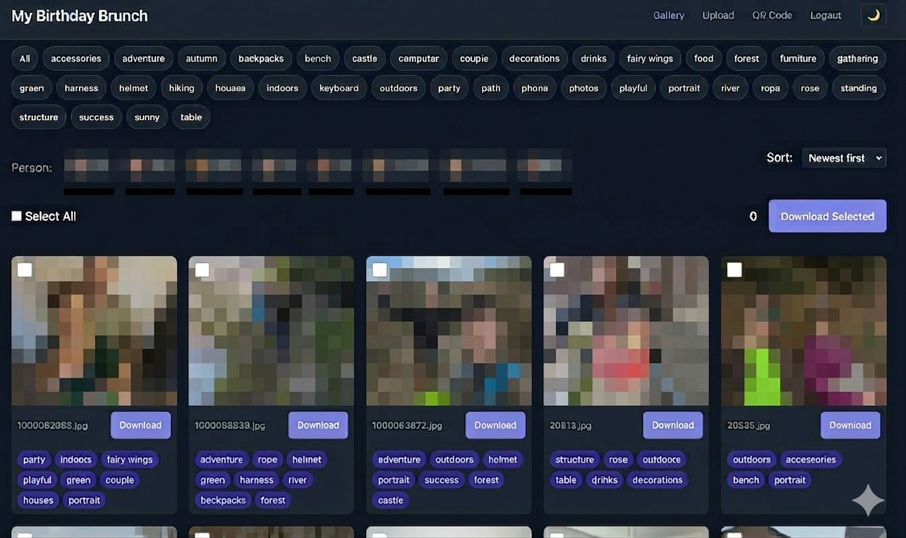

# PartyPix

Photo sharing platform for parties. Guests upload photos from their phones to a shared pool, with post-party access via tunneled URL and AI-powered tagging.



## Features

- **QR code generator** - Generate scannable QR codes for guest access
- **Multi-photo upload** - select and upload multiple photos at once
- Drag and drop support for uploads
- Upload progress indicator
- Live shared photo pool during the party
- **Upload toggle** - Admin can disable uploads after the party
- **Paginated gallery** - 50 photos per page for fast loading
- **Sort options** - Newest, oldest, or alphabetical
- Automatic thumbnail generation for fast browsing
- **Single photo download** - Download individual photos
- **Photo rotation** - Rotate photos 90° clockwise
- Admin panel for moderation (delete photos, add tags)
- **Analytics dashboard** - Photo count, tags, storage usage
- AI-powered semantic tagging using Ollama (post-party)
- Photo selection and ZIP download
- **Dark mode** - Auto-detects system preference, manual toggle available
- **Mobile-first design** - Responsive layout optimized for phones
- PWA support (add to home screen)
- **Face detection** - Automatically detect and group people in photos
- **Face filtering** - Filter gallery by person
- **Face management** - Admin can rename detected people

## Setup

### 1. Install Dependencies

```bash
pip install -r requirements.txt
```

### 2. Initialize for Your Party

```bash
python init.py \
    --title "Sarah's Birthday Bash" \
    --guest-password "party123" \
    --admin-password "secret123"
```

This creates:
- `app.db` - SQLite database
- `config.json` - Configuration with hashed passwords
- `storage/photos/` - Full-size images
- `storage/thumbnails/` - 300px thumbnails

### 3. Run During Party (Local Network)

```bash
python main.py --host 0.0.0.0 --port 8000
```

Guests access via `http://<pi-ip>:8000`. Display the QR code at the venue:
- Visit `/qr` to see the QR code
- Add `?url=<your-url>` to customize the URL (e.g., `/qr?url=http://192.168.1.100:8000`)

### 4. Post-Party Access (with ngrok)

```bash
ngrok http 8000 --authtoken <your-token>
```

Share the ngrok URL with guests for post-party browsing/download.

### 5. AI Tagging (Optional)

Requires [Ollama](https://ollama.ai/) installed with a vision model:

```bash
# Pull the vision model (qwen2.5vl:7b is default)
ollama pull qwen2.5vl:7b

# Start Ollama
ollama serve

# Run tagging (includes automatic tag consolidation)
python scripts/tag_photos.py

# Or with options:
python scripts/tag_photos.py --no-merge          # Tag only, skip merging
python scripts/tag_photos.py --merge-only        # Only merge, skip tagging
python scripts/tag_photos.py --model llama3.2-vision:11b  # Custom vision model
python scripts/tag_photos.py --consolidate-model llama3.2:3b  # Custom consolidation model
python scripts/tag_photos.py --ollama-host http://192.168.1.100:11434  # External Ollama host
```

This analyzes all photos and adds semantic tags like "cake", "dancing", "group photo", etc.

After tagging, the script automatically consolidates similar tags:
- Rule-based: child→children, selfie→portrait, chair→furniture, tree→forest, backpack→backpacks, etc.
- LLM-based: Uses a powerful text model (default: qwen3:8b) to find additional semantic overlaps
- Robust JSON parsing with fallback for malformed responses
- All changes happen in a single database transaction for safety.

### 6. Face Detection (Optional)

Requires [dlib](https://github.com/davisking/dlib) compiled with CMake:

```bash
# Install CMake (required for dlib on Apple Silicon)
brew install cmake

# Install face_recognition (includes face_recognition_models)
pip install face-recognition
pip install git+https://github.com/ageitgey/face_recognition_models

# Run face detection
python scripts/detect_faces.py

# Options:
python scripts/detect_faces.py --reprocess  # Re-process all photos
python scripts/detect_faces.py --strict     # Stricter matching (0.4)
python scripts/detect_faces.py --list       # List detected faces
```

On first run:
- Detects all faces in photos using `face_recognition` library
- Uses DBSCAN clustering to group similar faces
- Assigns "Person 1", "Person 2", etc. in detection order
- Generates face thumbnails from first photo containing each person

On subsequent runs:
- Detects new faces only
- Matches to existing faces using distance threshold (0.5 by default)
- Creates new Person entries for unmatched faces

### Managing Faces

In the admin page (`/admin`):
- **View faces**: See all detected faces with thumbnails
- **Filter by person**: In the gallery, filter photos by clicking on a person's thumbnail
- **Rename**: Click on a person's name to rename them
- **Merge**: Click one face to select it (blue highlight), then click another to merge them into one
- **Delete**: Click the red [x] button to remove a face from all photos

## Reset for New Party

For a fresh party, simply delete the files and reinitialize:

```bash
rm -rf app.db config.json storage/*
python init.py --title "New Party" --guest-password "pass" --admin-password "admin"
```

## File Structure

```
Partypix/
├── main.py              # FastAPI entry
├── init.py              # One-time setup
├── config.json          # Generated config
├── app.db               # SQLite database
├── app/
│   ├── database.py      # DB connection
│   ├── models.py        # Photo, Tag, Face models
│   ├── auth.py          # Password auth
│   └── routes/         # API endpoints
├── static/              # CSS, JS
├── templates/           # HTML pages
├── storage/             # Photos + thumbnails + faces
└── scripts/
    ├── tag_photos.py    # AI tagging
    └── detect_faces.py  # Face detection
```

## Requirements

- Python 3.10+
- Raspberry Pi (or any local server)
- USB storage for photos (recommended)
- ngrok (for post-party access)
- Ollama + vision model (for AI tagging)
- CMake + dlib (for face detection)

## Routes

| Route | Description |
|-------|-------------|
| `/` | Redirects to gallery |
| `/login` | Password entry |
| `/gallery` | Photo gallery (requires login) |
| `/gallery?face=<id>` | Filter by person |
| `/upload` | Upload photos |
| `/qr` | QR code generator |
| `/admin` | Admin panel |
| `/admin/analytics` | Analytics dashboard |
| `/download` | ZIP download (POST) |
| `/api/photos/{id}/download` | Single photo download |
| `/api/photos/{id}/full` | Full-size photo |
| `/api/faces` | List all faces |
| `/api/faces/{id}` | Rename face (PATCH) |
| `/admin/photo/{id}/rotate` | Rotate photo (POST) |
| `/admin/photo/{id}/delete` | Delete photo (POST) |

## License

MIT
